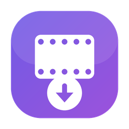

# Reelo — Vimeo Review Folder Downloader

**Reelo** is a native macOS app that downloads every video in a public Vimeo *review* folder in one click, as a batch. It is written in pure Swift + SwiftUI, with no external dependencies (no yt-dlp, no ffmpeg, nothing).

<p align="center">
  
</p>

## Download

Grab the latest build from the [Releases](../../releases) page as `Reelo-v1.0-macOS-arm64.dmg`.

1. Download and open the `.dmg`.
2. Drag **Reelo** into your **Applications** folder.
3. The app is distributed unsigned, so on first launch macOS may warn you. The first time, right-click the app and choose **Open**, or go to **System Settings > Privacy & Security** and click **Open Anyway**. After that it launches normally.

Requirements: Apple Silicon (arm64) Mac, macOS 14 or later.

## Features

- **Batch download** of every video in a review folder, one after another.
- **Preview** of each video's thumbnail, duration and status in the list.
- **Animated status** ring that fills as each video downloads and turns into a green check when done.
- **Quality selection**: Best / 1080p / 720p / 480p / 360p.
- **Folder picker**: clicking the download location opens the native folder chooser.
- **Smart resume**: re-entering the same folder skips videos already downloaded. If you delete a downloaded file, Reelo notices and downloads it again.
- **Parallel downloads**: choose how many videos download at once in Settings.
- **Detailed error codes**: problems are shown with codes like `REELO-401` or `REELO-404` plus a readable message.
- **Sleep prevention**: your Mac stays awake while downloads are running.

## Usage

1. Open Reelo.
2. Paste a public, password-free Vimeo review link:
   ```
   https://vimeo.com/reviews/{review_id}/users/{user_id}/folders/{folder_id}
   ```
3. Choose the quality and the download folder.
4. Click **Download**.

> Note: Reelo only works with public review folders that allow downloads. In password-protected folders, or folders where downloading is disabled, the videos are listed but cannot be downloaded.

## How it works

Reelo obtains a session token (JWT) from the Vimeo review page and works through `api.vimeo.com` in these steps:

1. **Bootstrap**: the JWT is extracted from the `viewer-bootstrap` data on the review page.
2. **List**: videos are fetched page by page from `/users/{user}/projects/{folder}/items` (`Authorization: jwt <token>`).
3. **Download link**: for each video a signed CDN (MP4) link is fetched from `/videos/{id}/versions/{ver}/downloads`.
4. **Download**: the MP4 for the chosen quality is downloaded via `URLSession` with progress tracking.

## Architecture

The app is fully native Swift with no third-party libraries.

- **Views** (SwiftUI): `ContentView`, `SettingsView`, and UI components such as the status ring.
- **Services**: `VimeoAPIClient` (Vimeo review API and downloading) and `DownloadManager` (an `@Observable` view model that drives the download lifecycle).
- **Models**: `VideoItem`, `AppSettings`, and `DownloadArchive` (download history).

## Project structure

```
boink/
  boinkApp.swift          # App entry point (Reelo)
  Models/                 # VideoItem, AppSettings, DownloadArchive
  Services/               # VimeoAPIClient, DownloadManager
  Views/                  # ContentView, SettingsView
  Assets.xcassets/        # App icon
boink.xcodeproj/          # Xcode project
```

## Build

- Requires macOS 14.0+ and Xcode.
- Open `boink.xcodeproj` and run with **Cmd+R**.

## Transparency

This app was built through an iterative, AI-assisted development process.

## Privacy

Reelo collects no personal data and sends no analytics or telemetry. See [PRIVACY.md](PRIVACY.md) for details.

## License

[MIT](LICENSE)
