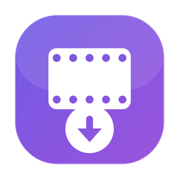

# Reelo — Vimeo Review Folder Downloader

**Reelo**, herkese açık Vimeo *review* klasörlerindeki videoları tek tıkla, toplu olarak indiren native bir macOS uygulamasıdır. Saf Swift + SwiftUI ile yazılmıştır; yt-dlp, ffmpeg veya başka hiçbir harici bağımlılık kullanmaz.

<p align="center">
  
</p>

## Özellikler

- **Toplu indirme** — Bir review klasöründeki tüm videoları sırayla indirir.
- **Önizleme** — Her videonun küçük görselini (thumbnail), süresini ve durumunu listede gösterir.
- **Kalite seçimi** — En iyi / 1080p / 720p / 480p / 360p.
- **Klasör seçici** — İndirme konumuna tıklayınca sistem klasör seçme penceresi açılır.
- **Devam etme** — Aynı klasörü tekrar girdiğinde daha önce inenler atlanır (ilerleme `~/Library/Application Support/boink_archives/` altında JSON olarak tutulur).
- **Paralel indirme** — Ayarlardan aynı anda kaç videonun ineceğini seçebilirsiniz.
- **Detaylı hata kodları** — Sorun olduğunda `REELO-401`, `REELO-404` gibi kodlarla birlikte açıklayıcı mesaj gösterir.
- **Uyku engelleme** — İndirme sürerken Mac uykuya geçmez.

## Kullanım

1. Reelo'yu açın.
2. Herkese açık, parolasız bir Vimeo review linkini yapıştırın:
   ```
   https://vimeo.com/reviews/{review_id}/users/{user_id}/folders/{folder_id}
   ```
3. Kaliteyi ve indirme klasörünü seçin.
4. **İndir**'e basın.

> Not: Yalnızca herkese açık ve indirmeye izin verilmiş review klasörlerinde çalışır. Parola korumalı ya da indirme kapalı klasörlerde videolar listelenir ama indirilemez.

## Nasıl çalışır

Reelo, Vimeo'nun review sayfasından bir oturum anahtarı (JWT) alır ve `api.vimeo.com` üzerinden şu adımları izler:

1. **Bootstrap** — Review sayfasındaki `viewer-bootstrap` verisinden JWT çıkarılır.
2. **Liste** — `/users/{user}/projects/{folder}/items` uç noktasından videolar sayfa sayfa çekilir (`Authorization: jwt <token>`).
3. **İndirme linki** — Her video için `/videos/{id}/versions/{ver}/downloads` uç noktasından imzalı CDN (MP4) bağlantısı alınır.
4. **İndirme** — Seçilen kalitedeki MP4, ilerleme takibiyle `URLSession` üzerinden indirilir.

## Derleme

- macOS 14.0+ ve Xcode gerektirir.
- `boink.xcodeproj`'i açıp **Cmd+R** ile çalıştırın.

## Lisans

[MIT](LICENSE)
